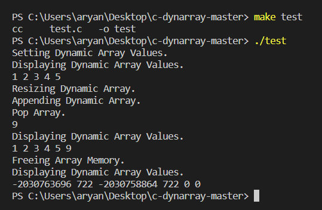

<p align = "center" style="font-size:40px;">
<b><u>
<!--PPS C Project--> 
 </u></b>
</p>
<p align = "center" style="font-size:40px;"><b>
 dynarray.c
 </b>
</p>
<p align="center">
    
    
</p>

> A simple, dynamically resizing array implementation in C. 🚀

## Working 📺

<div align="center">
  
</div>

## How to Use 🔧

Add dynarray.c file to your working repository.

Import the file to your working c file.

```
#include "dynarray.c"
```

## Documentation 📜

1.  Creates a dynamic array of length "size".

```
dynarray *newDynArray(int size)
```

2.  Resizes the memory of the array.

```
int resizeDynArray(dynarray *arr, int newSize)
```

3.  Returns the array element of index n.

```
int getElemDynArray(dynarray *arr, int n)
```

4.  Sets the values of the array of index n.

```
int setElemDynArray(dynarray *arr, int n, int value);
```

5.  Appends a value at the end of the array.

```
void appendDynArray(dynarray *arr, int x);
```

6.  Returns the last element of the array.

```
int popDynArray(dynarray *arr);
```

7.  Clears the memory of the array.

```
void freeDynarray(dynarray *arr);
```


## Team 💥


| <p align="center"><br>[Kshitij](https://github.com/kshitij9065)</p> | <p align="center"><br>[Kaustubh](https://github.com/kaustubhhh10)</p> |
| -------------------------------------------------------------------------------------------------------------------------------------- | -------------------------------------------------------------------------------------------------------------------------------------- |
